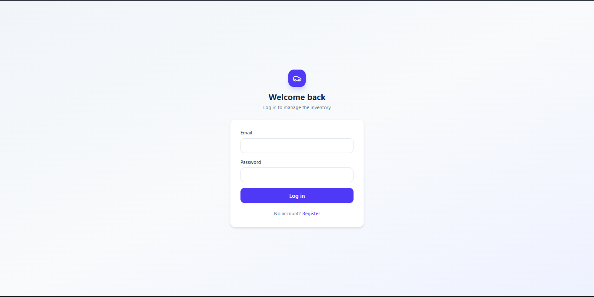
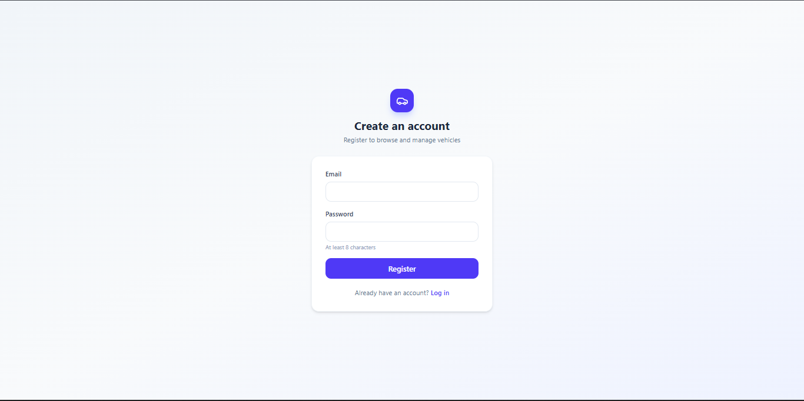
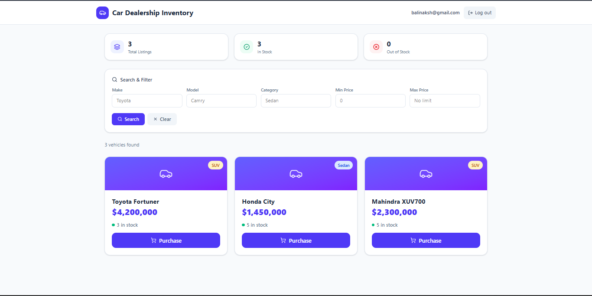
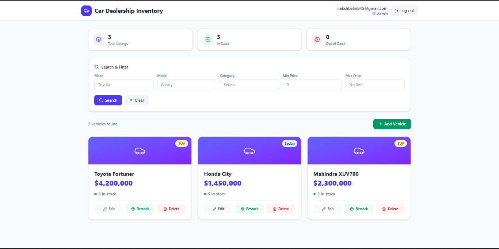
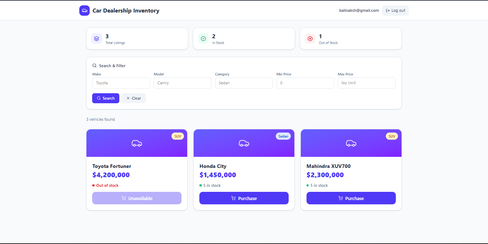

# Car Dealership Inventory System

A full-stack inventory management system for a car dealership, built as a TDD kata. Users can browse and purchase vehicles; admins can manage the inventory (add, edit, delete, restock).

## Overview

- **Backend**: FastAPI (Python) + SQLite, JWT authentication, RESTful API, built test-first with pytest (15 tests, 96% coverage).
- **Frontend**: React + Vite + Tailwind CSS, a single-page app with role-based UI (regular users vs. admins).
- **Auth**: Email/password registration and login, JWT-based sessions, role (`is_admin`) encoded in the token.

## Features

- User registration and login
- Browse all vehicles, with search/filter by make, model, category, and price range
- Purchase a vehicle (disabled automatically when out of stock)
- Admin-only: add, edit, delete, and restock vehicles
- Responsive UI with live stock status, toast notifications, and loading states

## Tech Stack

| Layer | Technology |
|---|---|
| Backend | FastAPI, SQLAlchemy, SQLite, python-jose (JWT), passlib (bcrypt) |
| Frontend | React, Vite, Tailwind CSS v4, React Router, Axios, lucide-react |
| Testing | pytest, pytest-cov |

## Project Structure

```
car-dealership-inventory/
├── backend/
│   ├── app/
│   │   ├── models.py          # SQLAlchemy models (User, Vehicle)
│   │   ├── schemas.py         # Pydantic request/response schemas
│   │   ├── security.py        # Password hashing, JWT creation/decoding
│   │   ├── dependencies.py    # Auth guards (get_current_user, require_admin)
│   │   ├── database.py        # DB engine/session setup
│   │   ├── main.py            # FastAPI app entrypoint
│   │   ├── routes/
│   │   │   ├── auth.py        # /api/auth/register, /api/auth/login
│   │   │   └── vehicles.py    # /api/vehicles/* (CRUD, search, purchase, restock)
│   │   └── tests/
│   │       ├── test_auth.py
│   │       └── test_vehicles.py
│   └── requirements.txt
└── frontend/
    └── src/
        ├── api/client.js           # Axios instance with JWT interceptor
        ├── context/AuthContext.jsx # Login/register/logout state
        ├── pages/                  # Login, Register, Dashboard
        └── components/             # VehicleCard, SearchBar, VehicleForm, Toast, etc.
```

## Setup Instructions

### Backend

```bash
cd backend
python -m venv venv
venv\Scripts\activate        # Windows
# source venv/bin/activate   # macOS/Linux
pip install -r requirements.txt
uvicorn app.main:app --reload
```

The API runs at `http://localhost:8000`. Interactive docs available at `http://localhost:8000/docs`.

### Frontend

```bash
cd frontend
npm install
npm run dev
```

The app runs at `http://localhost:5173` (or the next available port, e.g. `5174`).

### Running Tests

```bash
cd backend
python -m pytest app/tests/ -v
```

### Creating an Admin User

New registrations default to regular users. To promote a user to admin (run from `backend/`, with the venv active):

```bash
python -c "
from app.database import SessionLocal
from app import models
db = SessionLocal()
user = db.query(models.User).filter(models.User.email == 'your-email@example.com').first()
user.is_admin = True
db.commit()
print('Done:', user.email, 'is_admin =', user.is_admin)
"
```

This is intentionally not exposed as a self-service option in the UI — granting admin rights isn't something a user should be able to do to themselves; in a real deployment, this would happen via a bootstrap script or an existing admin promoting others.

## Screenshots

### Login


### Register


### Dashboard


### Admin Controls


### Out of Stock


## Test Report

15/15 tests passing, 96% overall coverage:

```
Name                         Stmts   Miss  Cover   Missing
----------------------------------------------------------
app/__init__.py                  0      0   100%
app/database.py                 11      4    64%   15-19
app/dependencies.py             18      2    89%   17, 21
app/main.py                      9      0   100%
app/models.py                   16      0   100%
app/routes/__init__.py           0      0   100%
app/routes/auth.py              22      0   100%
app/routes/vehicles.py          69      5    93%   52, 54, 56, 58, 65
app/schemas.py                  23      0   100%
app/security.py                 21      2    90%   30-31
app/tests/__init__.py            0      0   100%
app/tests/conftest.py           25      0   100%
app/tests/test_auth.py          22      0   100%
app/tests/test_vehicles.py      80      1    99%   12
----------------------------------------------------------
TOTAL                           316     14    96%
15 passed in 8.41s
```

Uncovered lines are mostly defensive error paths (e.g. `database.py`'s connection cleanup, `security.py`'s JWT-decode failure branch) not exercised directly by the happy/sad-path tests written.

## My AI Usage

I used **Claude** (Anthropic) throughout this project, in an interactive session, for backend scaffolding, test-first implementation, frontend development, debugging, and UI design.

**How I used it:**
- **Backend**: Claude and I followed strict Red-Green-Refactor — for each feature (auth, vehicle CRUD, search, purchase/restock), Claude wrote a failing test first, we confirmed it failed for the right reason (missing route, not a logic bug), then implemented the minimum code to pass it. This is reflected directly in the commit history.
- **Frontend**: Claude built the React components (auth context, pages, vehicle cards, forms) which I then ran, tested manually against the live backend, and iterated on with Claude when issues came up (e.g. a CORS misconfiguration I hit when connecting the two for the first time).
- **Debugging**: When I hit environment issues (PowerShell execution policy blocking npm, low disk space stalling the Vite build, PATH not persisting for Node.js), Claude walked me through diagnosing and fixing each one.
- **UI/UX**: I asked Claude to improve the initial (very plain) UI — it added category color-coding, toast notifications, skeleton loading states, and a stats summary bar.
- **My own contribution**: I ran and verified every test and feature myself before committing, made the design call on the admin/purchase-button question, structured and ran the git commit sequence personally (grouping files by logical TDD step, not just what Claude suggested verbatim), and manually tested every user flow (register, login, purchase, admin CRUD) end-to-end in the browser myself.

**Reflection**: AI accelerated the boilerplate and scaffolding significantly — what would have taken me a full day to research and write (JWT auth setup, SQLAlchemy models, Tailwind styling) took a few hours. The tradeoff is that I had to be deliberate about actually reading and understanding each file rather than blindly trusting it, since I'm the one who has to defend these design decisions in the interview. Debugging the environment issues (PowerShell, PATH, disk space) was a good forcing function for that — those weren't things Claude could fix for me remotely, so I had to actually run commands and interpret errors myself.

## PROMPTS.md

See [`PROMPTS.md`](./PROMPTS.md) for the full prompt history used during development.
